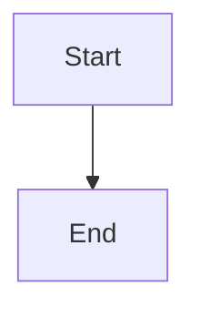

# Asset Export Error Fixture

One figure that renders, one that fails, and one image that cannot be read:
the asset report must name all three, with the two failures marked.



```mermaid
invalid syntax here
```


