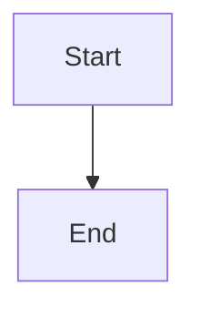
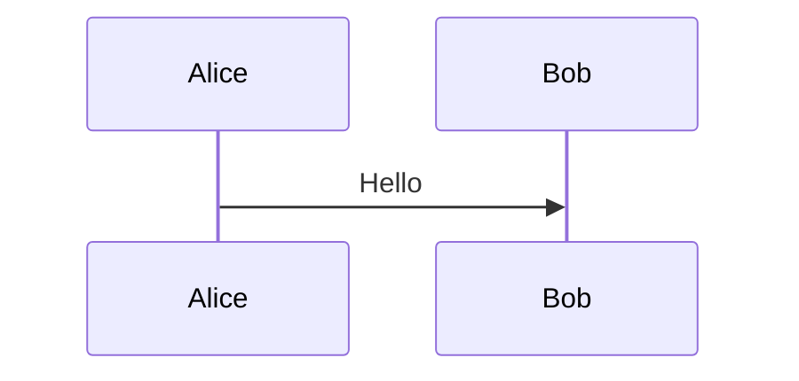

# Asset Export Fixture

The figures and images of this document, in the order `documd --assets` sees
them: one image, then two figures from different engines.

Text between the figures.

Trailing text.
